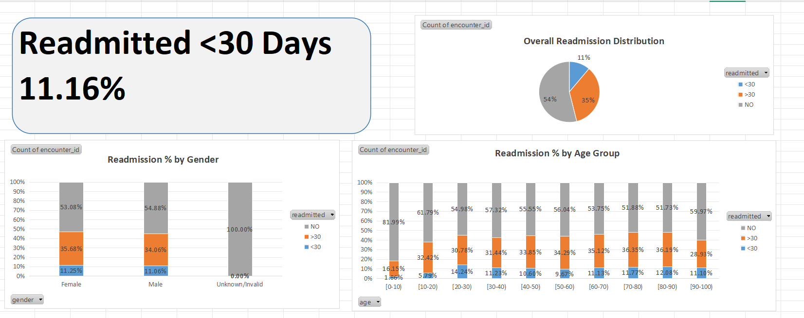
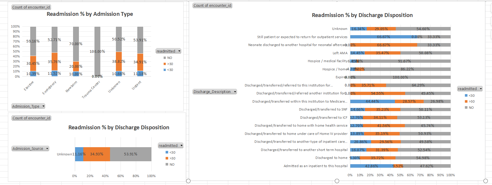
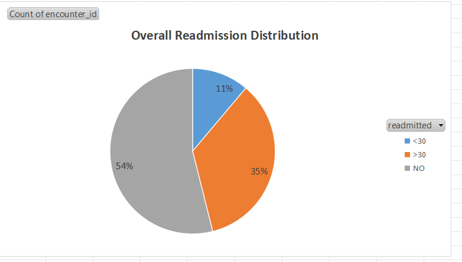
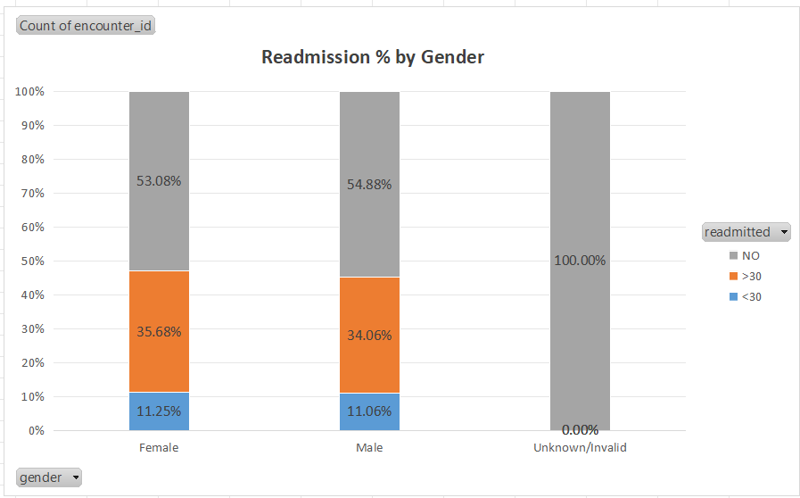
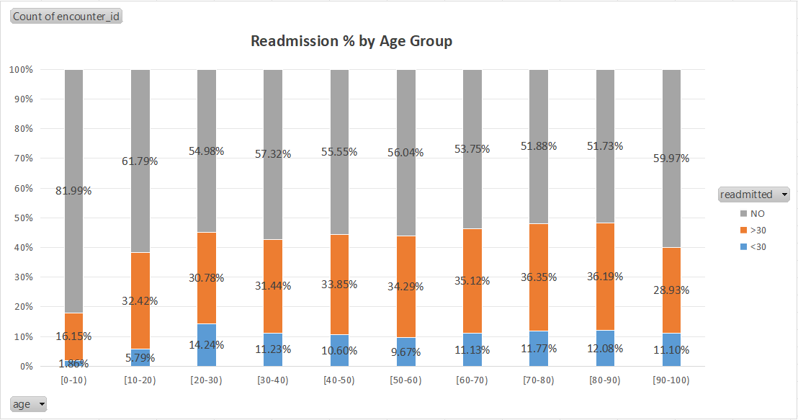
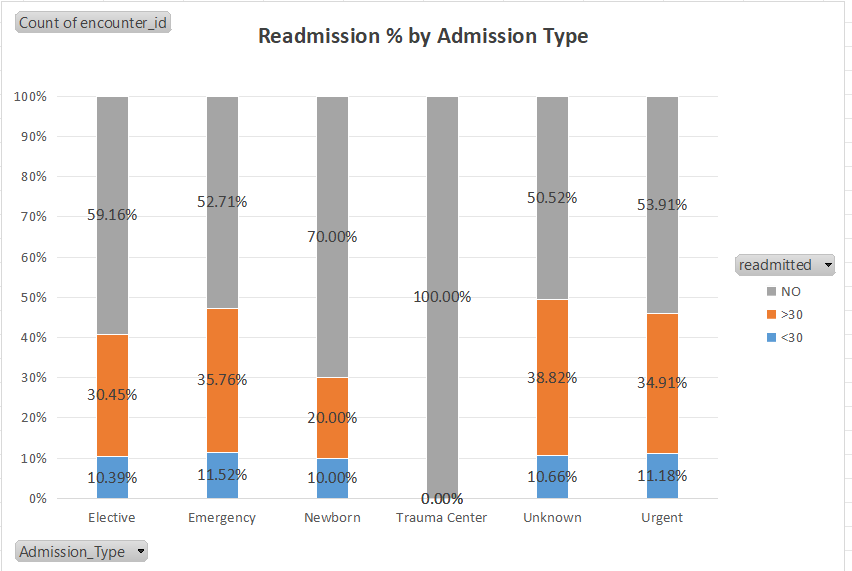
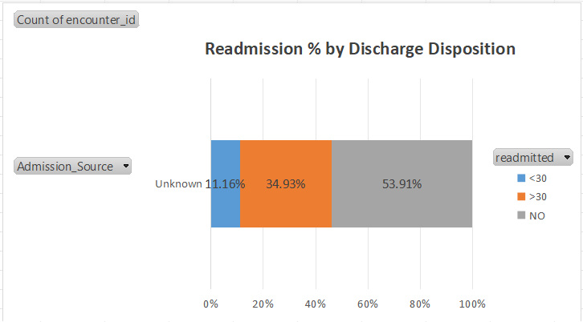
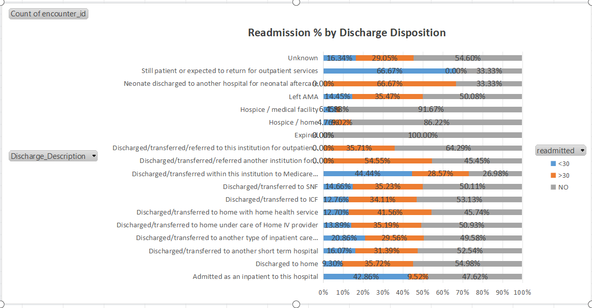

# 🏥 Hospital Readmission Analysis (Excel Dashboard)

## 📊 Overview
This project analyzes **100K+ hospital patient records** to evaluate **readmission rates** and identify risk factors.  
Using Excel PivotTables, XLOOKUP, and conditional logic, interactive dashboards were built to uncover insights into patient demographics, admission types, and discharge dispositions.

---

## 🚀 Features
- 📌 KPI Card: **Readmitted <30 Days = 11.16%**
- 📊 Overall readmission distribution
- 👤 Gender-based analysis
- 🎂 Age group analysis
- 🏥 Admission type analysis
- 🏠 Discharge disposition analysis
- 📊 Two interactive dashboards (Overview & Process)

---

## 📂 Dashboards

### 1. Overview Dashboard

### 2. Process Dashboard

---

## 📈 Key Insights
- **11.16%** of patients were readmitted within 30 days.  
- Higher readmissions observed in **Emergency admissions** and **SNF (Skilled Nursing Facility) discharges**.  
- Age **60–80** shows relatively higher short-term readmissions.  
- Gender differences are minimal but present (slightly higher in females).  

---

## 🗂 Individual Chart Visualizations
- **Overall Readmission Distribution**  
  

- **Readmission % by Gender**  
  

- **Readmission % by Age Group**  
  

- **Readmission % by Admission Type**  
  

- **Readmission % by Admission Source**  
  

- **Readmission % by Discharge Disposition**  
  

---

## 📎 Files
- `hospital_dashboard.xlsx` → Excel file with pivot tables and charts.  
- `images/` → Exported visualizations and dashboards.  
- `README.md` → Project documentation.  
- `LICENSE` → MIT License.  

---

## 🛠 Tools Used
- Microsoft Excel (PivotTables, Charts, Conditional Formatting, XLOOKUP)  
- Data Cleaning & Mapping  
- Visualization & Dashboarding  

---

## 📜 License
This project is licensed under the **MIT License**.
